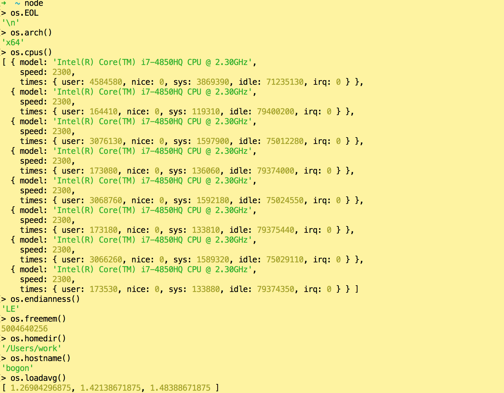
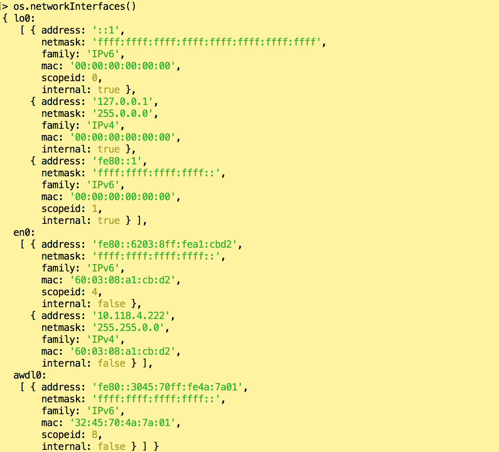
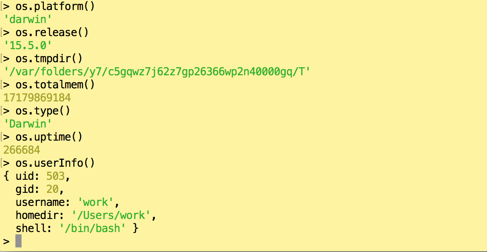

#OS

提供一些跟操作系统相关的方法。

使用require('os')来访问该模块


以下是我机器截图,供参考





##os.EOL
一个常量,操作系统行尾标识。

##os.arch()
返回操作系统CPU架构,如:`x64`,`arm`,`ia32`,返回`process.arch`的值。

##os.cpus()
返回一个数组对象,该对象包括了CPU的安装信息:model,speed,times

例:
```
[ { model: 'Intel(R) Core(TM) i7 CPU         860  @ 2.80GHz',
    speed: 2926,
    times:
     { user: 252020,
       nice: 0,
       sys: 30340,
       idle: 1070356870,
       irq: 0 } },
  { model: 'Intel(R) Core(TM) i7 CPU         860  @ 2.80GHz',
    speed: 2926,
    times:
     { user: 306960,
       nice: 0,
       sys: 26980,
       idle: 1071569080,
       irq: 0 } },
  { model: 'Intel(R) Core(TM) i7 CPU         860  @ 2.80GHz',
    speed: 2926,
    times:
     { user: 248450,
       nice: 0,
       sys: 21750,
       idle: 1070919370,
       irq: 0 } },
  { model: 'Intel(R) Core(TM) i7 CPU         860  @ 2.80GHz',
    speed: 2926,
    times:
     { user: 256880,
       nice: 0,
       sys: 19430,
       idle: 1070905480,
       irq: 20 } },
  { model: 'Intel(R) Core(TM) i7 CPU         860  @ 2.80GHz',
    speed: 2926,
    times:
     { user: 511580,
       nice: 20,
       sys: 40900,
       idle: 1070842510,
       irq: 0 } },
  { model: 'Intel(R) Core(TM) i7 CPU         860  @ 2.80GHz',
    speed: 2926,
    times:
     { user: 291660,
       nice: 0,
       sys: 34360,
       idle: 1070888000,
       irq: 10 } },
  { model: 'Intel(R) Core(TM) i7 CPU         860  @ 2.80GHz',
    speed: 2926,
    times:
     { user: 308260,
       nice: 0,
       sys: 55410,
       idle: 1071129970,
       irq: 880 } },
  { model: 'Intel(R) Core(TM) i7 CPU         860  @ 2.80GHz',
    speed: 2926,
    times:
     { user: 266450,
       nice: 1480,
       sys: 34920,
       idle: 1072572010,
       irq: 30 } } ]

```
##os.endianness()
参考[字节序](http://es6.ruanyifeng.com/#docs/arraybuffer#字节序)

##os.freemem()
返回空闲内存大小,单位byte

##os.homedir()
返回当前用户的主文件夹位置

##os.hostname()
返回操作系统的主机名称

##os.loadavg()
返回1,5,15分钟的平均负载

##os.networkInterface()
获取网络信息列表

```
{ lo:
   [ { address: '127.0.0.1',
       netmask: '255.0.0.0',
       family: 'IPv4',
       mac: '00:00:00:00:00:00',
       internal: true },
     { address: '::1',
       netmask: 'ffff:ffff:ffff:ffff:ffff:ffff:ffff:ffff',
       family: 'IPv6',
       mac: '00:00:00:00:00:00',
       internal: true } ],
  eth0:
   [ { address: '192.168.1.108',
       netmask: '255.255.255.0',
       family: 'IPv4',
       mac: '01:02:03:0a:0b:0c',
       internal: false },
     { address: 'fe80::a00:27ff:fe4e:66a1',
       netmask: 'ffff:ffff:ffff:ffff::',
       family: 'IPv6',
       mac: '01:02:03:0a:0b:0c',
       internal: false } ] }

```
##os.platform()
返回操作系统平台。值可能是darwin,freebsd,linux,sunos,win32,返回process.platform()的值

##os.release()
返回操作系统的版本。

##os.tmpdir()
返回操作系统默认临时文件夹

##os.totalmem()
返回系统总的内存大小,单位byte


##os.type()
返回操作系统名称,例:linux,darwin,windows_NT。

##os.uptime()
返回系统运行时间,单位second(秒)。

##os.userInfo(\[options])
- `options` \<Objecct>
    - `encoding` \<String>


